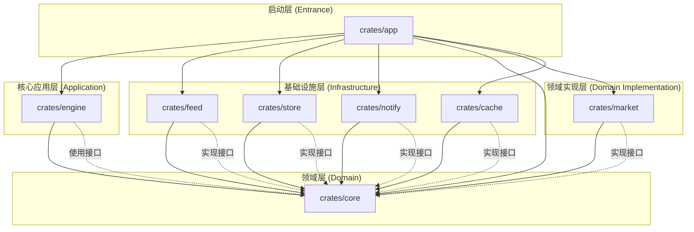

# Okane 系统架构说明书

## 1. 架构图 (Mermaid)

## 2. 模块职责说明 (Crates)
- **core**: 定义系统核心。包含 `Stock` 聚合根、`Candle` 时序数据、以及 `MarketDataProvider`、`Market` 领域服务等 **Port (端口/接口)**。它是系统的防腐层核心，不依赖外部。
- **market**: 领域逻辑实现。负责 `Market` 和 `Stock` 契约的具体实现。包含单源订阅、多路广播、以及基于引用计数的资源自动回收逻辑。
- **feed**: 行情抓取适配器。实现 `MarketDataProvider`，目前对接 Yahoo Finance。
- **store**: 数据持久化适配器。实现存储接口，负责 SQLite 的物理读写。
- **cache**: 业务无关的异步 KV 存储接口。它仅作为数据在内存中的载体，不感知具体业务逻辑。
- **engine**: 策略引擎。提供双运行时支持：
  - **JsEngine (主线)**：基于 `rquickjs` (QuickJS) 在沙盒中直接执行 JavaScript 策略，覆盖开发、调试、回测、生产全生命周期。
  - **WasmEngine (储备)**：基于 `wasmtime` 执行其他编译型语言（Rust/C/Go）生成的 WASM 策略模块，暂不优先实现。
- **notify**: 通知适配器。实现信号推送逻辑 (Telegram/Email)。
- **app**: 引导程序。负责将上述模块进行“接线”（依赖注入），启动主循环。

## 3. 核心领域对象：Stock 聚合根
`Stock` 是系统中最核心的聚合根，它具备以下特性：
- **身份唯一性**: 同一个 Symbol 在内存中仅存在一个物理聚合根实例。
- **能力内聚**: 封装了实时流订阅、瞬时价格查询、历史回溯等所有行情行为。
- **生命周期自愈 (Weak-Hub 模式)**: 
    - `Market` 注册表持有 `Weak<StockInner>` 引用，外部（Engine/API）持有 `Arc<dyn Stock>` 引用。
    - 当所有外部 `Arc` 被释放时，聚合根自动触发 `Drop`，清理注册表并停止底层的抓取任务（Feed Connection）。

## 4. 核心流程
1. **获取**: 外部模块通过 `Market::get_stock("AAPL")` 获取聚合根。若已有实例，则返回现有引用。
2. **数据链**: `feed` (抓取) -> `market` (广播并存入 `cache`) -> `store` (落库)。
3. **逻辑链**: `engine` (获取聚合根并订阅/查询) -> `notify` (推送)。
4. **隔离性**: 策略逻辑运行在 QuickJS 沙盒中，默认无任何 I/O 能力，所有平台能力通过 `host` 对象显式注入。

## 5. 技术特性
- **运行时**: `tokio`
- **数据库**: `sqlx` (SQLite)
- **策略引擎 (双运行时)**:
  - **JsEngine (主线)**: 基于 `rquickjs`，在 QuickJS 沙盒中直接执行 JS 策略。沙盒默认无文件/网络等 I/O 能力，配置 32MB 内存、1MB 栈大小限制。平台能力通过 `host` 对象注入（`log`、`now`、`fetchHistory`）。
  - **WasmEngine (储备)**: 基于 `wasmtime`，为未来其他编译型语言策略预留。代码保留但暂不优先实现。
  - **驱动模型 (Push Loop)**: 采用 Host-Driven 模式。引擎持有 `market.subscribe()` 流，每当有新 K 线时，主动调用策略的 `onCandle` 回调。
  - **注意**: QuickJS 为单线程运行时（`AsyncContext` 不是 `Send`），在 tokio 多线程环境中需使用 `LocalSet::spawn_local`。
- **序列化**: `serde` + `serde_json`
- **数据获取模式**:
    *   **Pull (拉取)**: 用于回测或补全历史数据，通过 `fetch_candles` 同步获取。
    *   **Push (订阅)**: 用于实时策略追踪，通过 `subscribe` 返回一个异步流 (`Stream`)。
    *   **屏蔽差异**: Provider 必须保证订阅接口可用。对于不支持原生长连接的源，应在内部通过异步轮询 (Polling) 模拟实时流。
- **注释文档规范**：
    * 对外暴露的函数方法必须包含 `///` 注释，详细说明 `# Logic` (逻辑步骤), `# Arguments`, `# Returns`。
    * 对外暴露的数据集合或抽象接口必须包含 `///` 注释，详细说明 `# Summary` (设计意图),  `# Invariants` (约束规则)。
    * 对外暴露的成员字段必须包含 `//` 注释，解释其含义。
- **编码规范**：
    * 禁止在`lib.rs`中编写逻辑代码
    * 禁止在`lib.rs`中使用`pub use`导出

## 6. 代码组织规范 (Code Organization)

项目遵循 **单模块单目录 (Single Module per Directory)** 的拆分原则，杜绝“上帝文件”。

### Core 领域层目录结构
`crates/core` 必须按照**业务子域**进行垂直切分，每个子域拥有独立的目录和 `mod.rs` 入口。接口定义文件统一命名为 `port.rs`。

*   **`common/`**: 通用基础类型。
    *   包含: `Stock`, `TimeFrame`
*   **`market/`**: 行情相关业务。
    *   包含: `entity.rs` (Candle), `port.rs` (MarketDataProvider, Market & Stock Traits), `error.rs` (MarketError)
*   **`store/`**: 持久化相关业务。
    *   包含: `port.rs` (MarketStore), `error.rs` (StoreError)
*   **`notify/`**: 通知相关业务。
    *   包含: `port.rs` (Notifier), `error.rs` (NotifyError)

### 设计原则
1.  **高内聚**：相关联的 Entity, Error, Port 必须在逻辑上归属于同一个业务子域。
2.  **物理隔离**：通过目录层级强制隔离不同业务域的实现细节。
3.  **显式 Port**：所有需要外部实现的抽象行为必须在各子域的 `port.rs` 中定义。

## 7. 缓存规范 (Cache Standard)

### 7.1 定义与职责
Cache 被定义为一个**业务无关的异步 KV 存储接口**。它仅作为数据在内存中的载体，不感知具体业务逻辑。

### 7.2 接口规约
- **标准操作**：必须实现 `set`、`get`、`del` 三个核心方法。
- **泛型支持**：接口应支持通过序列化/反序列化进行强类型数据的存取。
- **管理策略**：Cache 内部不提供 TTL (过期时间) 或容量淘汰机制。数据的新鲜度维护与版本管理完全由上游业务逻辑自行实现。
