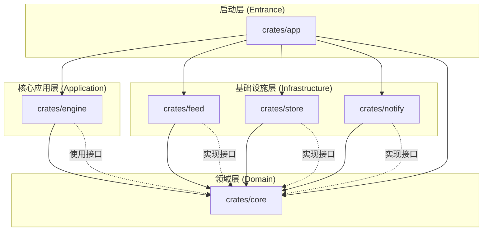

# Okane 系统架构说明书

## 1. 架构图 (Mermaid)

## 2. 模块职责说明 (Crates)
- **core**: 定义系统核心。包含 `Stock` 实体、`Candle` 时序数据、以及 `MarketDataProvider` 等 **Port (端口/接口)**。它是系统的防腐层核心，不依赖外部。
- **feed**: 行情抓取适配器。实现 `MarketDataProvider`，目前对接 Yahoo Finance。
- **store**: 数据持久化适配器。实现存储接口，负责 SQLite 的物理读写。
- **engine**: 策略引擎。负责加载 WASM 脚本，并调用存储的数据进行指标计算和信号生成。
- **notify**: 通知适配器。实现信号推送逻辑 (Telegram/Email)。
- **app**: 引导程序。负责将上述模块进行“接线”（依赖注入），启动主循环。

## 3. 核心流程
1. **数据链**: `feed` (抓取) -> `store` (落库)。
2. **逻辑链**: `engine` (计算) -> `notify` (推送)。
3. **隔离性**: 策略逻辑运行在 WASM 沙箱中，通过 `core` 定义的标准接口与系统交互。

## 4. 技术特性
- **运行时**: `tokio`
- **数据库**: `sqlx` (SQLite)
- **WASM 策略引擎**: 采用 **Extism** 框架。
  - **理由**: 提供开箱即用的多语言 PDK 支持（允许使用 Go/JS/Rust 编写策略），自动处理复杂的 Host/Guest 内存交换（JSON/Bytes），大幅降低插件系统开发成本。
- **序列化**: `serde`
- **数据获取模式**:
    *   **Pull (拉取)**: 用于回测或补全历史数据，通过 `fetch_candles` 同步获取。
    *   **Push (订阅)**: 用于实时策略追踪，通过 `subscribe_candles` 返回一个异步流 (`Stream`)。
    *   **屏蔽差异**: Provider 必须保证订阅接口可用。对于不支持原生长连接的源，应在内部通过异步轮询 (Polling) 模拟实时流。
- **注释文档规范**：
    * 对外暴露的函数方法必须包含 `///` 注释，详细说明 `# Logic` (逻辑步骤), `# Arguments`, `# Returns`。
    * 对外暴露的数据集合或抽象接口必须包含 `///` 注释，详细说明 `# Summary` (设计意图),  `# Invariants` (约束规则)。
    * 对外暴露的成员字段必须包含 `//` 注释，解释其含义。

## 5. 代码组织规范 (Code Organization)

项目遵循 **单模块单目录 (Single Module per Directory)** 的拆分原则，杜绝“上帝文件”。

### Core 领域层目录结构
`crates/core` 必须按照**业务子域**进行垂直切分，每个子域拥有独立的目录和 `mod.rs` 入口。接口定义文件统一命名为 `port.rs`。

*   **`common/`**: 通用基础类型。
    *   包含: `Stock`, `TimeFrame`
*   **`market/`**: 行情相关业务。
    *   包含: `entity.rs` (Candle), `port.rs` (MarketDataProvider), `error.rs` (MarketError)
*   **`store/`**: 持久化相关业务。
    *   包含: `port.rs` (MarketStore), `error.rs` (StoreError)
*   **`notify/`**: 通知相关业务。
    *   包含: `port.rs` (Notifier), `error.rs` (NotifyError)

### 设计原则
1.  **高内聚**：相关联的 Entity, Error, Port 必须在逻辑上归属于同一个业务子域。
2.  **物理隔离**：通过目录层级强制隔离不同业务域的实现细节。
3.  **显式 Port**：所有需要外部实现的抽象行为必须在各子域的 `port.rs` 中定义。
