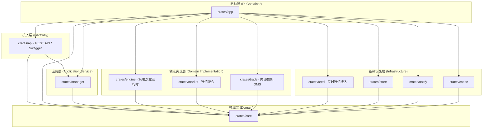

# Okane 技术架构说明书 (Architecture)

## 1. 系统架构图 (Mermaid)

```mermaid
graph TB
    subgraph "接入层 (Gateway)"
        API[crates/api - REST API / Swagger]
    end

    subgraph "启动层 (DI Container)"
        App[crates/app]
    end

    subgraph "应用层 (Application Service)"
        Manager[crates/manager]
    end

    subgraph "领域实现层 (Domain Implementation)"
        MarketImpl[crates/market - 行情聚合]
        TradeImpl[crates/trade - 内部模拟 OMS]
        Engine[crates/engine - 策略沙盒运行时]
    end

    subgraph "领域层 (Domain)"
        Core[crates/core]
    end

    subgraph "基础设施层 (Infrastructure)"
        Feed[crates/feed - 实时行情接入]
        Store[crates/store]
        Notify[crates/notify]
        Cache[crates/cache]
        %% Broker[crates/broker - 实盘通道 计划中]
    end

    %% 编译期依赖关系
    API --> Manager
    API --> Core
    
    App --> API
    App --> Manager
    App --> Engine
    App --> Feed
    App --> Store
    App --> Notify
    App --> MarketImpl
    App --> TradeImpl
    App --> Cache
    App --> Core

    Manager --> Core

    %% 实现层依赖
    Engine --> Core
    MarketImpl --> Core
    TradeImpl --> Core
    Feed --> Core
    Store --> Core
    Notify --> Core
    Cache --> Core
```

## 2. 模块职责说明 (Crates)

- **core**: 系统核心领域定义。包含聚合根 (`Stock`, `StrategyInstance`)、实体 (`Candle`, `Order`) 和接口端口 (`Market`, `TradePort`, `StrategyStore`)。它是系统的防腐层核心，不依赖任何外部逻辑。
- **api**: 外部接入网关。负责基于 `axum` 的 RESTful 接口分发、JWT 认证中间件、以及 Swagger 文档自动生成。
- **manager**: 应用调度中心。负责 `StrategyInstance` 的全生命周期管控，协调行情与执行引擎，驱动 `tokio::spawn` 协程运行。
- **market**: 领域逻辑实现。负责 `Stock` 行情聚合根的维护，支持多路订阅广播与基于引用计数的资源自动清理。
- **engine**: 策略执行器。实现 `EngineBuilder` 接口。目前主要为 **JsEngine**：基于 `rquickjs` 的沙盒，提供隔离且受限的策略运行环境。
- **trade**: 内盘 OMS (Order Management System)。在实盘通道未接入前，提供本地撮合引擎 (`Matcher`)，支持纸面交易、盈亏计算与回测成交模拟。
- **feed**: 行情抓取适配器 (Adapter)。实现 `MarketDataProvider`。
- **store**: 持久化适配器。基于 SQLite 负责策略配置、账户资产与历史行情的物理存取。
- **app**: DI 容器与引导程序。负责组件实例化、对象依赖注入 (Arc 注入) 并启动 API 监听。

## 3. 核心设计模式

### 3.1 Weak-Hub 生命周期管理
- `Market` 注册表持有 `Weak<StockInner>`，而外部引用持有 `Arc<dyn Stock>`。
- 当最后一个 `Arc` 被释放（如策略停止不再订阅），聚合根自动触发 `Drop`，清理注册表并关闭底层的 `Feed` 网络连接。

### 3.2 纸面交易与模拟撮合
- `TradeService` 封装了账户资金冻结、订单状态管理和持仓更新逻辑。
- `LocalMatchEngine` 接收行情 Tick 并触发订单的成交判定（限价单击穿判定）。

## 4. 控制链与数据流

1. **控制向**：`External Request` -> `API` -> `Manager` -> `Engine` (控制生命周期)。
2. **数据向**：`Feed` -> `Market` -> `Broadcaster` -> `Engine (onCandle)`。
3. **交易向**：`Engine` -> `TradePort` -> `TradeService` (内部 OMS) -> `AccountStore`。

## 5. 存储架构

- **SQLite 冷热分离**：
    - **热数据**：活跃策略日志实时流驻留在内存缓冲区 (`DashMap`)。
    - **冷数据**：通过 JSONL 追加写入物理文件，并由 SQLite 建立索引以便随机访问。
